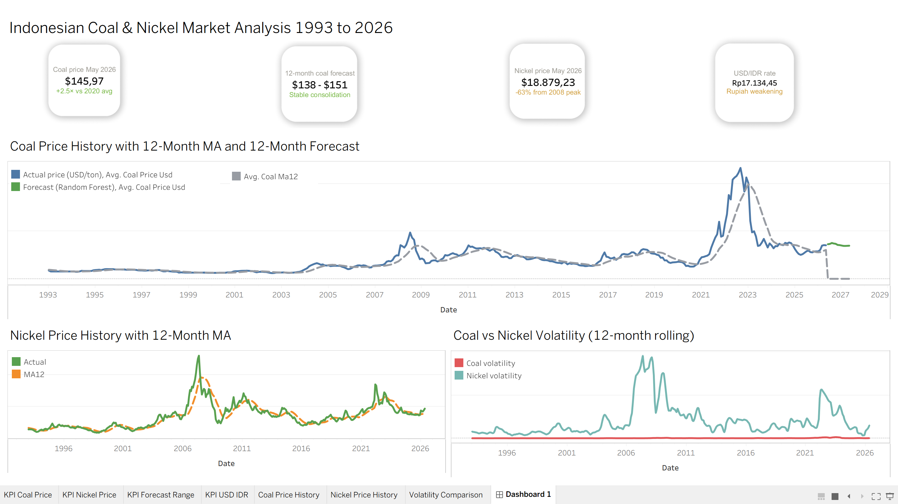

# Indonesian Mining & Commodity Price Analysis

## Overview
A data science project analyzing 33 years of Indonesian coal and nickel 
price data (1993–2026), combining time series analysis, statistical 
decomposition, and a machine learning forecasting model. Built to 
demonstrate end-to-end data science skills using real commodity market data.

## Key Findings
- Coal prices are driven by 3 separate forces: long term trend, yearly 
  seasonal cycle, and unpredictable shock events (GFC, COVID, Russia-Ukraine)
- Nickel is significantly more volatile than coal, with single-month 
  drops of nearly $10,000 during the 2008 GFC
- A weakening Rupiah amplifies revenue for Indonesian exporters since 
  commodities are priced in USD but costs are in IDR
- Last month's coal price explains 90% of next month's price (confirmed 
  by both PACF analysis and Random Forest feature importance)
- 12 month forecast projects coal prices at $138-151 per ton through May 2027

## Model Performance
| Metric | Value |
|--------|-------|
| MAE | $6.58 per ton |
| RMSE | $9.70 per ton |
| MAPE | 5.2% |

## Project Structure
| Notebook | Description |
|----------|-------------|
| 01_data_collection | Web scraping and API data collection from FRED |
| 02_cleaning | Data cleaning and feature engineering (23 features) |
| 03_eda | Exploratory analysis with 6 charts and business insights |
| 04_time_series | Decomposition, stationarity tests, ACF/PACF analysis |
| 05_forecasting | Random Forest forecasting model with 12 month predictions |
| 06_insights | Full business insights report |

## Tools Used
Python, Pandas, NumPy, Matplotlib, Seaborn, Statsmodels, Scikit-learn, 
Prophet, Requests, Jupyter Notebook

## Data Sources
- Coal prices: World Bank via FRED API (PCOALAUUSDM)
- Nickel prices: World Bank via FRED API (PNICKUSDM)
- USD/IDR exchange rate: Bank Indonesia via FRED API (CCUSMA02IDM618N)

## Dashboard Preview

## How to Run
1. Clone this repo
2. Run pip install -r requirements.txt
3. Open notebooks in order 01 through 06
4. Data is automatically collected via API in notebook 01, no manual download needed
